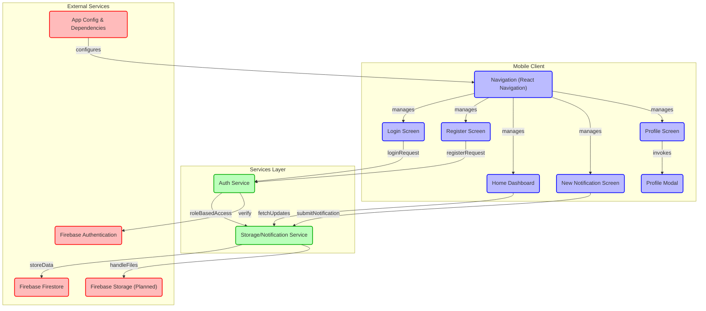

```mermaid
flowchart TD
    %% Mobile Client Layer
    subgraph "Mobile Client"
        LoginScreen("Login Screen"):::mobile
        RegisterScreen("Register Screen"):::mobile
        HomeDashboard("Home Dashboard"):::mobile
        NewNotificationScreen("New Notification Screen"):::mobile
        ProfileScreen("Profile Screen"):::mobile
        ProfileModal("Profile Modal"):::mobile
        Navigation("Navigation (React Navigation)"):::mobile
    end

    %% Services Layer
    subgraph "Services Layer"
        AuthService("Auth Service"):::service
        StorageService("Storage/Notification Service"):::service
    end

    %% External Services Layer
    subgraph "External Services"
        FirebaseAuth("Firebase Authentication"):::external
        FirebaseFirestore("Firebase Firestore"):::external
        FirebaseStorage("Firebase Storage (Planned)"):::external
        AppConfig("App Config & Dependencies"):::external
    end

    %% Relationships within Mobile Client
    Navigation -->|"manages"| LoginScreen
    Navigation -->|"manages"| RegisterScreen
    Navigation -->|"manages"| HomeDashboard
    Navigation -->|"manages"| NewNotificationScreen
    Navigation -->|"manages"| ProfileScreen
    ProfileScreen -->|"invokes"| ProfileModal

    %% Interactions from Mobile Screens to Services
    LoginScreen -->|"loginRequest"| AuthService
    RegisterScreen -->|"registerRequest"| AuthService
    NewNotificationScreen -->|"submitNotification"| StorageService
    HomeDashboard -->|"fetchUpdates"| StorageService

    %% Inter-Service Communication
    AuthService -->|"roleBasedAccess"| StorageService

    %% Services interactions with External Systems
    AuthService -->|"verify"| FirebaseAuth
    StorageService -->|"storeData"| FirebaseFirestore
    StorageService -->|"handleFiles"| FirebaseStorage

    %% App Config influences Navigation
    AppConfig -->|"configures"| Navigation

    %% Click Events for Mobile Frontend Screens
    click LoginScreen "https://github.com/juanbrusatti/municipalidad-app/blob/main/screens/Login.js"
    click RegisterScreen "https://github.com/juanbrusatti/municipalidad-app/blob/main/screens/Register.js"
    click HomeDashboard "https://github.com/juanbrusatti/municipalidad-app/blob/main/Home/Home.js"
    click HomeDashboard "https://github.com/juanbrusatti/municipalidad-app/blob/main/screens/Home.js"
    click NewNotificationScreen "https://github.com/juanbrusatti/municipalidad-app/blob/main/screens/NewNotification.js"
    click ProfileScreen "https://github.com/juanbrusatti/municipalidad-app/blob/main/screens/ProfileModalScreen.js"
    click ProfileScreen "https://github.com/juanbrusatti/municipalidad-app/blob/main/Home/Profile.js"

    %% Click Event for UI Component
    click ProfileModal "https://github.com/juanbrusatti/municipalidad-app/blob/main/components/ProfileModal.js"

    %% Click Event for Navigation Layer
    click Navigation "https://github.com/juanbrusatti/municipalidad-app/blob/main/App.js"

    %% Click Events for Services Layer
    click AuthService "https://github.com/juanbrusatti/municipalidad-app/blob/main/services/authService.js"
    click StorageService "https://github.com/juanbrusatti/municipalidad-app/blob/main/services/storageService.js"

    %% Click Events for External Configuration and Dependencies
    click AppConfig "https://github.com/juanbrusatti/municipalidad-app/blob/main/app.json"
    click AppConfig "https://github.com/juanbrusatti/municipalidad-app/blob/main/package.json"
    click AppConfig "https://github.com/juanbrusatti/municipalidad-app/tree/main/node_modules"

    %% Styles Definition
    classDef mobile fill:#bbf,stroke:#00f,stroke-width:2px;
    classDef service fill:#bfb,stroke:#0a0,stroke-width:2px;
    classDef external fill:#fbb,stroke:#f00,stroke-width:2px;
```
